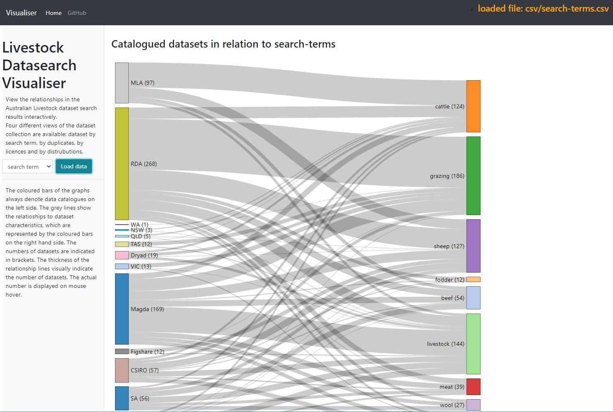

# datasearch
Scripts for querying Australian public data APIs. These scripts are part of my PhD project. 

-------------------------
## Dataset search scripts and supporting files

### ands-search.html
Script that fetches dataset listing from ANDS via registry widget. See [RDA Registry Search Widget](https://documentation.ardc.edu.au/display/DOC/RDA+Registry+Search+Widget) for details. Has a modifiable results template.

### ckan_apis.json
JSON specification for CKAN APIs - used by scripts querying all CKAN instances. 
Name of API has to be unique, and needs a url and API key (note: key needed for VIC CKAN API). Will run without specifying API key, but will return result set without results for that API and will give no error.

### CKAN_search.php
Several data catalogues are based on the [CKAN API](https://github.com/ckan/ckan). With this script, a user can select one or more of the available Australian CKAN APIs (refer to ckan_apis.json) and specify search terms and max number of results to return. Returns a html table of results and total number of datasets found, highlighting any duplicates found. This table can be copied and pasted into a spreadsheet for further processing. 

### magda_search.php
Data.gov.au is built on the [Magda API](https://magda.io/docs/). This script queries the magda API, a user can specify search term and optional search tags(keywords). Very similar in output to CKAN search results.

### mla_reports_list.html
[Meat & Livestock Australia](https://www.mla.com.au/) publishes market livestock reports. These are available via a public API. This script obtains a list of available reports from that API, and provides a URL to query each report. Details of API can be found [here](http://statistics.mla.com.au/Assets/MLA%20Statistics%20Database%20API%20Methodology.pdf).

### rda_getRIFCS_API.php
The [Australioan National Data Service](https://www.ands.org.au/) has several API endpoints for data searches. This is a script using the getRIFCS API, and the output is a html table. API Documentation is at https://documentation.ardc.edu.au/display/DOC/getRIFCS.

### search_all.php
Searches magda catalog first and then goes through CKAN instances. Marks madgda resu(work in progress). Output is a html table of results.

### search-csiro-api-v2.php
[CSIRO data](https://data.csiro.au/collections/) is available via DAP Web Services and OpenAPI, details as per the [Developer Tools](https://confluence.csiro.au/display/dap/Developer+Tools) page. This script uses the OpenAPI endpoint, documentation can be found on the [CSIRO Data Access Portal Web Services](https://data.csiro.au/dap/swagger-ui.html#/) page. 

### search-figshare-openapi.php
[Figshare](https://figshare.com/) uses [OpenAPI](https://github.com/OAI/OpenAPI-Specification), and this script searches that catalogue, creating a html table as output.

-------------------------
## Resultset visualisation (sankey graphs)
Can be found in the /visualise directory. The live version of [Graphs](https://narrawin.github.com/datasearch/visualise) allows the viewing of data in different ways. Data is based on a spreadsheet that summarises results of all the data searches using the above scripts as well as manual searches.

This application shows the output from several data summaries based on that spreadsheet and uses the [D3.js](https://d3js.org/) library, and is based on a sample application by [subrata20011997](https://blockbuilder.org/subrata20011997/e943f89f678eb77d0c9a5c6bbc64986f). Screenshot below:

-------------------------

### other files see superceded directory
##### CKAN_search_all.php 
User can specify search terms. Returns table of results and number of finds. Identifies duplicates (by dataset name). 

##### magda_packages.php 
Very basic script. User needs to specify search terms in script. All functionality now in magda_search.php. Only keeping it as it has the older code that lists rganisations and facets at start of output.

-------------------------

